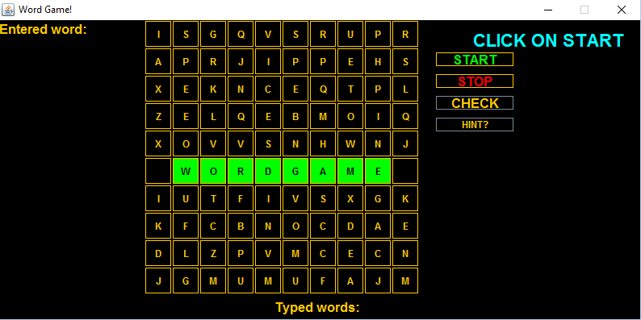
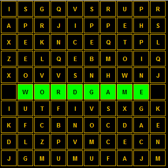
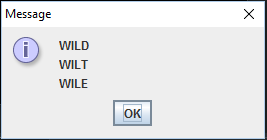

# WordGame
Make a word and explore them.

Word Game is a simple Java based interactive word game in which one has to form a word from a given set of Characters given that each character can only be used once.

The score is based on the length of the word, So try this game and prove to the World that you can make the longest word in less time!

How to install:
1. Download the zip file from Clone or Download option above.
2. Extract The contents of the zip file to a folder.
3. Fire up Eclipse, Then click on import in File menu -> Existing Projects into workspace -> locate the folder in which files are extracted and select the project
4. Build and run the project and Enjoy the Game!

How to Play:
1. Click the 'start' buttons to form word.
2. Keep forming as many words as you can and submit them by clicking 'check' button.
3. If the enter word is a valid word then the score will be incremented.
4. Use 'hint' button to get help.
5. Stop the Game by clicking on the 'stop' button and your score and time taken will be displayed.

Features:
1. Make the longest word and check it in the dictionary automatically to get more score.
2. Not sure how to complete the word? Try using Hint for possible ways to complete your word!
3. Enjoy the simple and interactive fun to play game.

Rules:
1. Only dictionary words are counted.
2. Score will be incremented based on the length of the typed word.
3. Number of hints you can use is 6. After using 3 hints score will be deducted by 3.
4. After making word, you need to check if it is valid.
5. Time of the game will be displayed after the game is stopped.
6. After clicking a tile it will be no more accessible.

Images:

Staring Screen:

  

Button Grid: 

  

Hint Box:

  

  

Team Members: 
1. Salim Mapkar
2. Khan Maaz
3. Rumi Shaikh
4. Uday Singh

